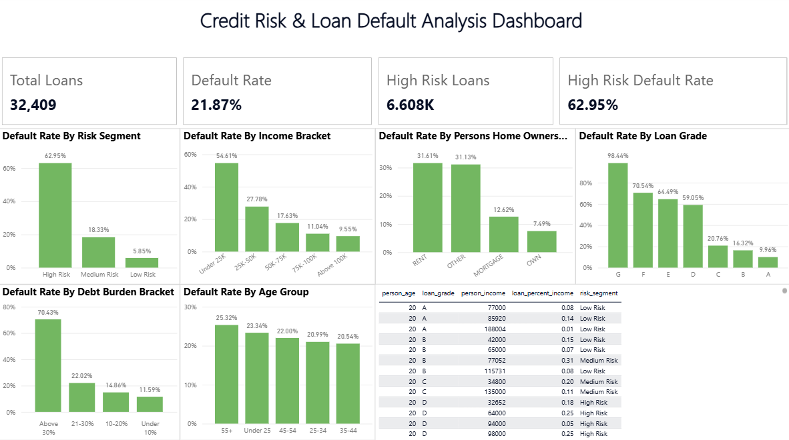

# Credit Risk & Loan Default Analysis Dashboard

An interactive Power BI dashboard analyzing 32,409 loan records to identify key drivers of default risk across borrower segments, loan grades, and financial profiles.


*(Add a screenshot of your final dashboard here before pushing)*

---

## 📊 Overview

| Metric | Value |
|---|---|
| Total Loans Analyzed | 32,409 |
| Overall Default Rate | 21.87% |
| High Risk Loans | 6,608 |
| High Risk Default Rate | 62.95% |
| Total Loan Volume | ~$310.9M |
| Estimated Exposure at Default | ~$76.9M |
| Average Interest Rate | 11.02% |
| Average Loan Amount | $9,592 |

---

## 🔑 Key Insights

**1. Loan grade is the strongest predictor of default.**
Default rate climbs sharply and almost linearly from Grade A to Grade G:
- Grade A: 9.96% → Grade D: 59.05% → Grade G: 98.44%
- Grades D–G (though only ~15% of loan volume) carry disproportionately high risk.

**2. Debt burden is a critical risk signal.**
Borrowers with a debt-to-income ratio **above 30%** default at **70.4%**, compared to just **11.6%** for those under 10% — a 6x difference.

**3. Income bracket strongly correlates with repayment ability.**
Borrowers earning under $25K default at **54.6%**, versus **9.6%** for those earning above $100K.

**4. Renters and "Other" housing status default more than homeowners.**
- RENT: 31.6% default rate
- OTHER: 31.1%
- MORTGAGE: 12.6%
- OWN: 7.5%
Home ownership status is a strong (and low-cost) proxy for financial stability.

**5. Risk segmentation (model-derived) is highly predictive.**
- High Risk segment: 62.95% default rate (6,608 loans)
- Medium Risk: 18.3% (11,366 loans)
- Low Risk: 5.9% (14,435 loans)

**6. Age has minimal predictive power.**
Default rates are relatively flat across age groups (20.5%–25.3%), suggesting age alone is a weak standalone risk factor compared to income, debt burden, or loan grade.

---

## 🧮 Methodology

- **Source data:** `Tableau_Ready_Data.csv` — loan-level records including borrower demographics, income, employment length, loan terms, and default status (`loan_status`: 1 = Default, 0 = Repaid).
- **Segmentation:** `risk_segment` field is a pre-computed categorical risk tier (High/Medium/Low) derived from underlying loan and borrower attributes.
- **Tooling:** Power BI Desktop — DAX measures for Default Rate, Expected Loss, and Portfolio Value at Risk; conditional formatting for risk visualization; cross-filtered interactive charts.

---

## 🛠️ Dashboard Features

- KPI summary cards (Total Loans, Default Rate, High Risk Loans, High Risk Default Rate)
- Default rate breakdowns by: risk segment, income bracket, home ownership, loan grade, debt burden bracket, age group
- Percentage-formatted axes with in-chart data labels
- Row-level detail table for drill-down exploration

---

## 📁 Repository Contents

```
├── Data/
│   ├── Raw_Data.csv                          # Original source dataset
│   └── Cleaned_Data.csv                      # Cleaned/processed dataset used for analysis
├── Reports/
│   ├── Business_Insights.docx                # Business-facing insights writeup
│   ├── Data_Audit.docx                       # Data quality / audit notes
│   └── Day2_Summary.docx                     # Project progress summary
├── SQL/
│   ├── day1_day2_analysis.sql                # Exploratory analysis queries
│   └── day2_risk_segmentation_window.sql     # Risk segmentation logic
└── Dashboard/
    ├── Credit_Risk_Dashboard.pbix            # Power BI report file
    ├── dashboard_preview.png                 # Final dashboard screenshot
    └── README.md                             # This file
```

*(This README lives inside `Dashboard/` — see the repo root for the full project including `Data/`, `Reports/`, and `SQL/`.)*

---

## 🚀 How to Use

1. Clone this repo
2. Open `Credit_Risk_Dashboard.pbix` in Power BI Desktop
3. Refresh data if needed (Home → Refresh) — points to `Data/Cleaned_Data.csv`
4. Explore via cross-filtering — click any bar to filter the rest of the dashboard
5. See `Reports/` for detailed write-ups and `SQL/` for the underlying analysis queries

---

## 📌 Notes

This is a portfolio/analysis project using a public-style synthetic credit risk dataset. Figures represent the dataset provided and are not tied to any real financial institution.
